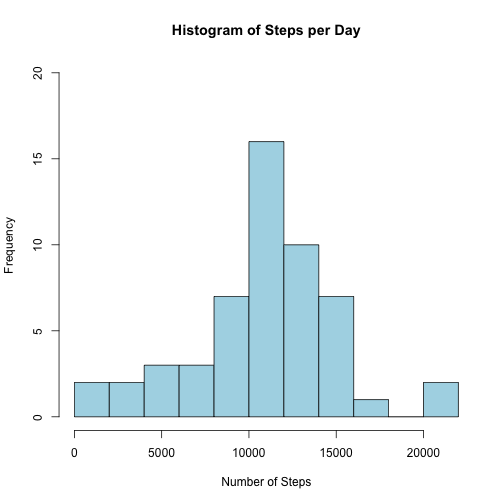
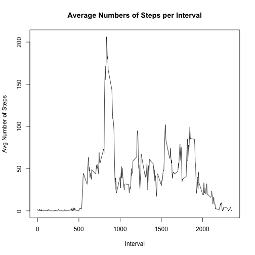
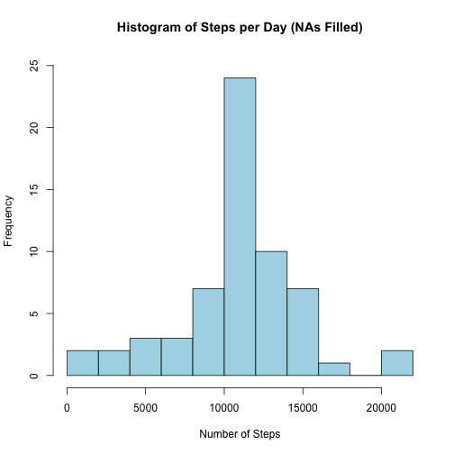
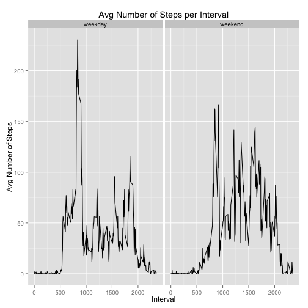

## Loading packages used

```r
library(dplyr)
```

```
## 
## Attaching package: 'dplyr'
## 
## The following object is masked from 'package:stats':
## 
##     filter
## 
## The following objects are masked from 'package:base':
## 
##     intersect, setdiff, setequal, union
```

```r
library (ggplot2)
```

## Loading and preprocessing the data


```r
stepData <- read.csv("activity.csv")
```

## What is mean total number of steps taken per day?

```r
# Remove NA values and group by date
stepDataNoNAs <- na.omit(stepData) %>%
        group_by(date)

# Summarize to get the total number of steps per day
stepsPerDay <- summarize(stepDataNoNAs, total = sum(steps))

# Create histogram of total number of steps per day
hist(stepsPerDay$total, main = "Histogram of Steps per Day",
     xlab = "Number of Steps",
     ylim = c(0,20),
     breaks = 10,
     col = "lightblue")
```

 

```r
# Get mean and median steps per day
mean(stepsPerDay$total)
```

```
## [1] 10766.19
```

```r
median(stepsPerDay$total)
```

```
## [1] 10765
```

## What is the average daily activity pattern?


```r
# Get mean number of steps per interval
meanStepsInterval <- aggregate(steps ~ interval, stepDataNoNAs, mean)

plot(meanStepsInterval$interval, meanStepsInterval$steps,
     type='l',
     main = "Average Numbers of Steps per Interval",
     xlab = "Interval",
     ylab = "Avg Number of Steps"
     )
```

 

```r
# Find the interval with the maximum average number of steps
filter(meanStepsInterval, steps == max(steps))
```

```
##   interval    steps
## 1      835 206.1698
```

## Imputing missing values


```r
# Create new data frame for stepData with imputed values for NAs and group by date
NAsFilledSD <- stepData %>%
        group_by(date)
```


```r
# Compute number of NA values in the step data
nrow(NAsFilledSD[!complete.cases(NAsFilledSD),])
```

```
## [1] 2304
```


```r
# Impute NA values with the average number of steps per current interval
for (i in 1:nrow(NAsFilledSD)){
        if (is.na(NAsFilledSD$steps[i])){
                interval <- NAsFilledSD$interval[i]
                intervalRowMSI <- filter(meanStepsInterval,interval == NAsFilledSD$interval[i])
                NAsFilledSD$steps[i] <-intervalRowMSI$steps
        }
}

# Summarize to get the total number of steps per day
stepsPerDay <- summarize(NAsFilledSD, total = sum(steps))

# Create histogram of total number of steps per day
hist(stepsPerDay$total, main = "Histogram of Steps per Day (NAs Filled)",
     xlab = "Number of Steps",
     ylim = c(0,25),
     breaks = 10,
     col = "lightblue")
```

 

```r
# Get mean and median steps per day
mean(stepsPerDay$total)
```

```
## [1] 10766.19
```

```r
median(stepsPerDay$total)
```

```
## [1] 10766.19
```
**The mean remains the same, while the median is now the same as the mean. You can see that there are quite a few more values in the median range**

## Are there differences in activity patterns between weekdays and weekends?


```r
# Change dates in imputed data from strings to date class
NAsFilledSD$date <- as.Date(NAsFilledSD$date, "%Y-%m-%d")

# Then create vector of days from dates
weekday <- weekdays(NAsFilledSD$date)

# Convert days to weekday or weekend
for (i in 1:length(weekday)){
        if (weekday[i] == "Saturday" || weekday[i] == "Sunday") {weekday[i] <- "weekend"}
        else {weekday[i] <- "weekday"}
}

# Add vector of days to imputed data as factor
NAsFilledSD$dayType <- as.factor(weekday)

# Get mean number of steps per interval and dayType
meanStepsInterval <- aggregate(steps ~ interval+dayType, NAsFilledSD, mean)

# Plot with qplot
qplot(interval, steps, data = meanStepsInterval,
      geom = "line",
      main = "Avg Number of Steps per Interval",
      xlab = "Interval",
      ylab = "Avg Number of Steps",
      facets = . ~ dayType
      )
```

 

**Steps appear to be more spread out throughout the day on weekend days.**
